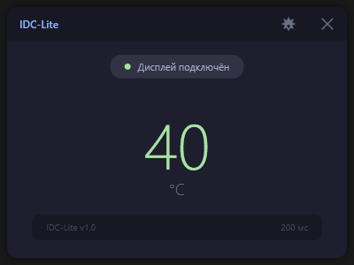
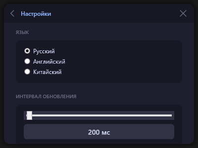
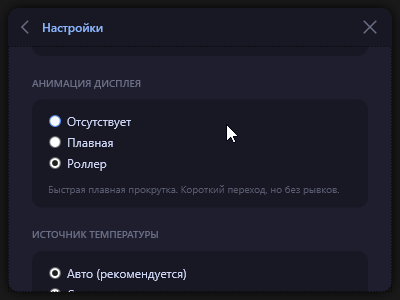
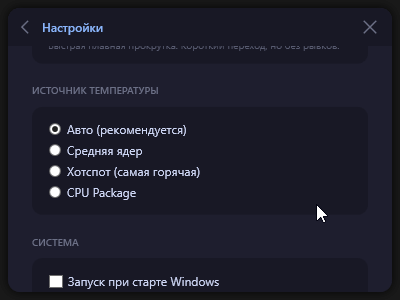
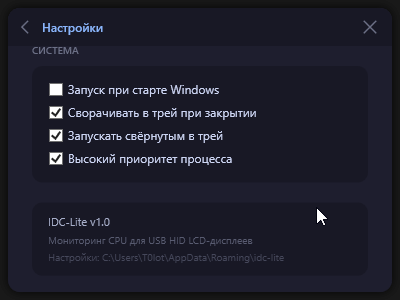

<div align="center">

# ❄️ IDC-Lite

**Нативная утилита для управления LCD-дисплеем СЖО ID-COOLING серии FX**

[](https://dotnet.microsoft.com/)

<br />



<br />
<br />

> ⚡ **Чистый C# / WPF без лишнего мусора.**  
> Делал для себя, потому что родной софт от ID-COOLING бесил вылетами, жрал память и намертво зависал.

</div>

---

## 🎯 Зачем этот проект?

Родное приложение на базе Chromium/Electron — это боль. Оно может внезапно намертво зависнуть под нагрузкой в игре, жрёт кучу ресурсов и разбрасывает файлы по всей системе. 

**IDC-Lite** решает эту проблему. Программа написана на нативном **WPF (.NET 8)**, общается с дисплеем напрямую через системные API Windows и не фризит, даже если процессор загружен на все 100%.

---

## 💡 Плюсы по сравнению с оригинальным софтом

- 📉 **В 2 раза меньше памяти:** ест всего ~100 МБ ОЗУ вместо 200+ МБ у оригинала.
- 🚀 **Современный и быстрый стек:** мгновенная работа без лагов.
- 🌍 **Полная локализация:** из коробки есть Русский, English и 中文 (в оригинале был только английский).
- 📦 **Портативность:** один `.exe` файл без всякой установки и разбрасывания мусора по системе.
- 🎬 **Выбор анимации обновления:** можно настроить визуальную динамику под себя.

---

## ✨ Основные возможности

- 🌡️ **Мониторинг CPU в реальном времени:** вывод актуальной температуры на LCD-дисплей СЖО.
- 🎯 **Гибкие источники данных:** автовыбор, средняя по ядрам, Hotspot или CPU Package.
- 📌 **Иконка в трее:** быстрый доступ к настройкам и информер температуры.
- 🚀 **Автозапуск & Фоновый режим:** старт вместе с Windows и свёртывание в системный трей.
- 🎨 **Приятный UI:** минималистичный интерфейс в тёмной палитре *Catppuccin Mocha*.

---

## 🖼️ Скриншоты

<div align="center">
  
  <p><i>Окно настроек программы</i></p>
</div>
<div align="center">
  
  <p><i>Окно настроек программы</i></p>
</div>
<div align="center">
  
  <p><i>Окно настроек программы</i></p>
</div>
<div align="center">
  
  <p><i>Окно настроек программы</i></p>
</div>

---

## 🛠️ Разработчикам & Linux

Это мой первый публичный проект, думаю все понимают что без агента тут не обошлось но код пару дней правился и отлаживался лично мной.  Писал под Windows, но теоретически основные используемые библиотеки поддерживаются и на Linux. 

> 🐧 **Если этот релиз скачает хотя бы один человек — я перепишу софт и под Linux!**

<details>
<summary><b>🔍 Системные Windows API (DLL)</b></summary>

<br />

| Системная DLL | Использование |
| :--- | :--- |
| `kernel32.dll` | `CreateFileW` / `WriteFile` — прямая отправка HID-отчётов на дисплей |
| `setupapi.dll` | Низкоуровневый поиск USB HID-устройств в системе |
| `hid.dll` | Получение атрибутов HID (валидация VID/PID) |
| `dwmapi.dll` | Нативная отрисовка тени окна через Desktop Window Manager |

</details>

<details>
<summary><b>🛠️ Поддержка других СЖО (Реверс-инжиниринг)</b></summary>

<br />

Утилита заточена под VID/PID `1A86:E317` и байты протокола `0x55`, `0xBB`.  
Если у вас другая водянка с HID-дисплеем, вы можете легко адаптировать код:
1. Снимите дампы USB-трафика через Wireshark / USBPcap.
2. Измените константы в файле [`Services/HidService.cs`](Services/HidService.cs).

</details>

---

## 📦 Сборка из исходников

Если хотите собрать автономный `.exe` самостоятельно:

```bash
# Клонировать репозиторий
git clone [https://github.com/ваш-юзернейм/idc-lite.git](https://github.com/ваш-юзернейм/idc-lite.git)

# Перейти в папку проекта
cd idc-lite

# Скомпилировать Self-Contained `.exe`
dotnet publish -c Release -r win-x64
